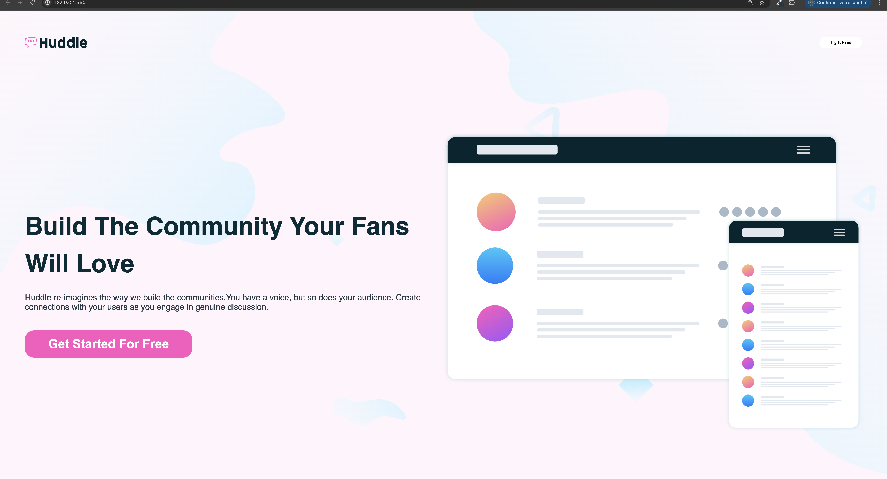
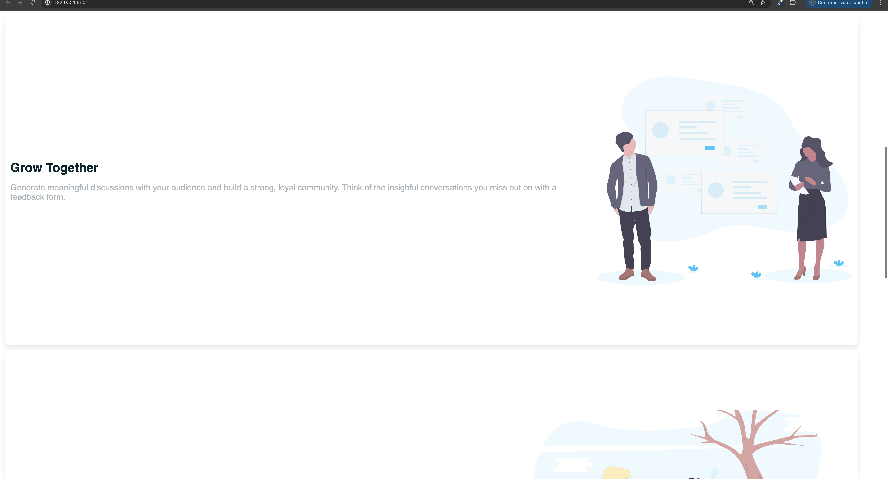
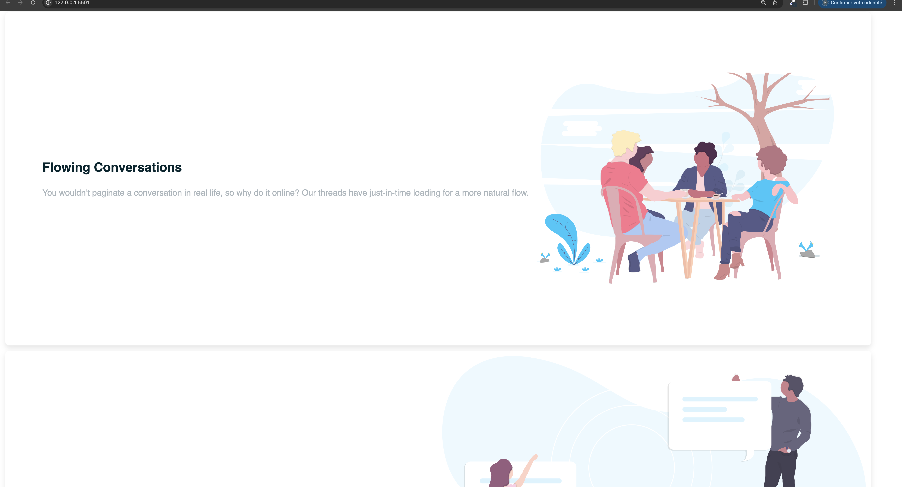
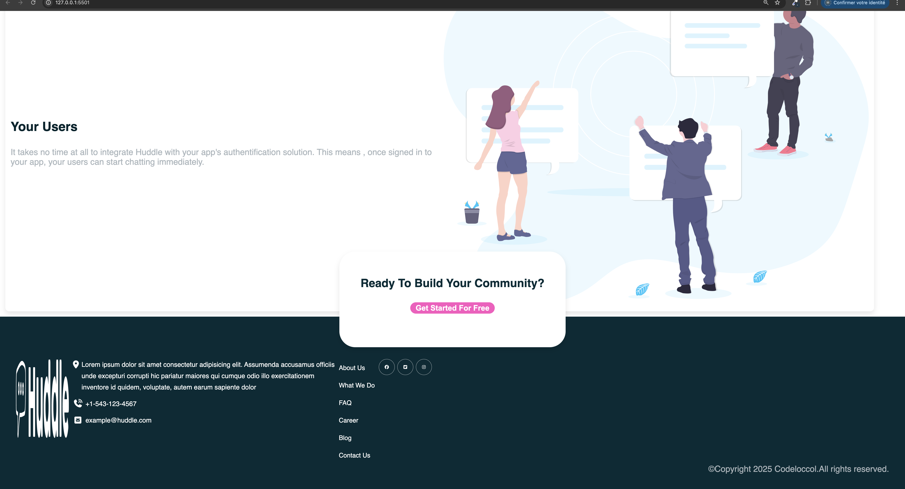

## Exercice_5: PROJET_Huddle_Ladding_Page

## Description
Le projet "Huddle Landing Page" consiste à créer une page d'atterrissage pour une plateforme fictive nommée Huddle. Cette page a pour objectif de montrer les capacités du site tout en étant moderne, responsive et attrayante. L’objectif principal est de structurer et styliser le contenu avec des balises HTML sémantiques et du CSS, tout en garantissant une expérience utilisateur optimale sur tous les appareils.

## Objectifs :

- Structurer une page web : Utilisation de balises HTML sémantiques pour améliorer l'accessibilité.

- Utiliser des images et des icônes : Intégration de graphiques pertinents pour une page attrayante.

- Maîtriser la mise en forme avec CSS : Travail sur les typographies, couleurs, espacements et boutons.

- Créer une page responsive : Adaptation de la page à différentes tailles d'écran en utilisant des media queries et Flexbox.

## Spécifications :

- Structure HTML sémantique : Utilisation des bonnes balises pour un contenu bien structuré.

- Polices et couleurs : Respect de la charte graphique (polices externes et palette de couleurs).

- Responsive : Page qui s'adapte aux écrans de différentes tailles (ordinateur de bureau, tablette, smartphone).

- Code propre : Indentation et organisation du code.

## HTML utilisé

Le projet utilise des balises HTML sémantiques telles que :

<header>, <main>, <section>, <footer> pour structurer le contenu.

<button>, , <h1>, 
 pour afficher des éléments interactifs et du contenu.

## CSS utilisé

Le CSS utilise principalement des propriétés de mise en forme et de positionnement :

- flexbox pour les mises en page flexibles.

- @media queries pour rendre la page responsive.

- Propriétés comme background-color, font-family, padding, margin, box-shadow pour styliser les éléments.

Exemple de règle CSS pour la responsivité :
@media screen and (max-width: 768px) {
  .container {
    width: auto;
    margin: auto;
  }
  .S1 {
    height: 80vh;
  }
}
## Capture d'ecran

## Lien github_page

[Demonstration](https://asmah003.github.io/Huddle_Ladding_Page/)

## Difficultés rencontrées

Lors de la réalisation de ce projet, la principale difficulté a été de positionner correctement les éléments dans le footer. Trouver un équilibre entre les icônes sociales, le texte de contact et la mise en page générale n’a pas été simple. De plus, gérer la responsivité a été un défi, notamment pour les écrans de petite taille. Le fait de maintenir une disposition fluide tout en gardant une bonne lisibilité sur les petits écrans a nécessité plusieurs ajustements.